```mermaid
%%{init: {
  "themeVariables": {
    "fontSize": "28px",
    "nodePadding": "20px",
    "edgeLabelFontSize": "30px"
  },
  "themeConfig": {
    "nodeTextMargin": 5,
    "padding": 15
  }
}}%%
flowchart TD
  A1["<table><tr><td align='left'><b>22 Oct 2022</b></td><td align='left'>Selected in GSTN – Software Engineer</td></tr></table>"]
  A2["<table><tr><td align='left'><b>Jan 2023</b></td><td align='left'>Full-time Research Associate @ IIIT Hyderabad</td></tr></table>"]
  A3["<table><tr><td align='left'><b>08 Jul 2023</b></td><td align='left'>TOEFL 101/120</td></tr></table>"]
  A4["<table><tr><td align='left'><b>10 Jul 2023</b></td><td align='left'>Joined GSTN as FT employee</td></tr></table>"]
  A5["<table><tr><td align='left'><b>Sep 2023</b></td><td align='left'>ASONAM’23 IEEE – 1st paper accepted</td></tr></table>"]
  
  A6["<table><tr><td align='left'><b>08 Jul 2024</b></td><td align='left'>GRE 306/340</td></tr></table>"]
  subgraph MS_Apps [Sep 2024 – MS Applications]
    direction TB
    A7["<table><tr><td align='left'><b>UT Dallas</b></td><td align='left'>(CSE) – Accepted</td></tr></table>"]
    A8["<table><tr><td align='left'><b>USC</b></td><td align='left'>(Scientist & Engineers CSE) – Accepted</td></tr></table>"]
    A9["<table><tr><td align='left'><b>UMass Amherst</b></td><td align='left'>(CSE) – Accepted</td></tr></table>"]
    A10["<table><tr><td align='left'><b>ASU</b></td><td align='left'>(EE) – Accepted</td></tr></table>"]
    A11["<table><tr><td align='left'><b>Purdue</b></td><td align='left'>(EE) – Accepted</td></tr></table>"]
    A12["<table><tr><td align='left'><b>Purdue</b></td><td align='left'>(CSE) – Rejected</td></tr></table>"]
    A13["<table><tr><td align='left'><b>CMU</b></td><td align='left'>(EE) – Rejected</td></tr></table>"]
    A14["<table><tr><td align='left'><b>NEU</b></td><td align='left'>(CSE) – Rejected</td></tr></table>"]
  end

  A15["<table><tr><td align='left'><b>Dec 2024</b></td><td align='left'>US Visa – Rejected</td></tr></table>"]
  A16["<table><tr><td align='left'><b>Jan 2025</b></td><td align='left'>Bangkok Trip – Canonical Event</td></tr></table>"]
  A17["<table><tr><td align='left'><b>23Apr</b></td><td align='left'>Offered Sr. Data Scientist @ GEP Worldwide, Hyderabad</td></tr></table>"]
  A18["<table><tr><td align='left'><b>10Jul</b></td><td align='left'>Exactly 2 Years After - Last working day at GSTN</td></tr></table>"]
  A19["<table><tr><td align='left'><b>14Jul</b></td><td align='left'>Joined GEP</td></tr></table>"]


  %% chain them all
  A1 --> A2 --> A3 --> A4 --> A5 --> A6 --> MS_Apps --> A15 --> A16 --> A17 --> A18 --> A19
```

  <h1>Tomar <a href="https://github.com/AryamannTomar/tle" style="text-decoration: none;"><i>x</i></a>..<a href="https://github.com/AryamannTomar/Cp31" style="text-decoration: none;"><i>x1</i></a>.....
            <a href="https://rb.gy/b22vml" style="text-decoration: none;"><i>y</i></a>.....
            <a href="https://rb.gy/neayvz" style="text-decoration: none;"><i>z</i></a> Aryamann</h1>
  

<h3 align="center">Quite Puzzled in My Life! Trying to Figure Out the Best Way Forward</h3>

 

📫 How to reach me: <i>How in the hell are you gonna reach me if I can't reach to myself Rn! xD</i> 
<h3 align="left">Languages and Tools:</h3>

                    

